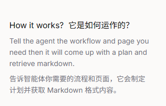
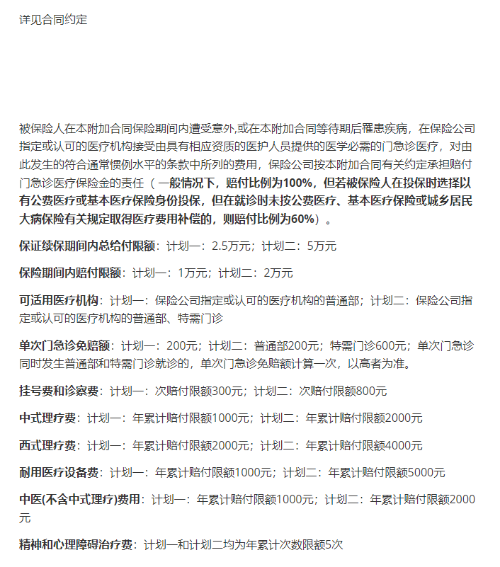

## Crawl4AI

​        Crawl4AI 是一个**开源、高性能的网页爬虫和刮取工具**，专为 AI 和大型语言模型（LLM）集成而设计。它将网页内容转换为结构化、干净且适合 AI 的格式，强调速度、灵活性和易用性。无论您是在构建 RAG 系统、训练数据管道，还是仅仅需要干净的网页内容提取，Crawl4AI 都提供了所需的工具，并配有开发者友好的 API。

### Crawl4AI和Firecrawl的对比

| 特性/工具        | **Crawl4AI**                                                 | **FireCrawl**                                                |
| ---------------- | ------------------------------------------------------------ | ------------------------------------------------------------ |
| **核心驱动**     | 基于大语言模型（LLM）解析网页语义结构（如 GPT-3.5-turbo、Llama 等） | 基于AI算法进行内容清洗，集成Playwright处理动态内容           |
| **内容解析能力** | 使用LLM识别标题、正文、列表等，支持自定义提示词              | 智能过滤广告、导航栏、页脚等噪声，输出干净的 Markdown / JSON |
| **动态内容支持** | 支持有限，依赖外部浏览器引擎或自定义配置                     | 原生支持 JavaScript 渲染（通过 Playwright）                  |
| **反爬机制**     | LLM生成随机 User-Agent、代理轮换策略，支持结合外部服务处理验证码 | 提供基础反爬支持，但更侧重内容清洗而非绕过复杂反爬           |
| **增量爬取**     | ✅ 支持通过哈希对比检测页面变化，仅抓取更新内容               | ❌ 不明确支持增量爬取（依赖用户自行实现）                     |
| **爬取模式**     | 单页为主，支持简单递归                                       | ✅ 支持单页抓取（`/scrape`）和深度爬取（`/crawl`），可设深度、路径过滤等 |
| **输出格式**     | JSON、Markdown、HTML 等                                      | Markdown、JSON（专为LLM/RAG优化）                            |
| **开发者支持**   | 提供API，SDK支持较少                                         | 提供 Python、Go、Rust 等多种语言的 SDK，集成更友好           |
| **适用场景**     | - 结构多变的垂直网站 - 舆情监控 - 长尾数据采集         | - RAG系统数据准备 - 大模型训练数据 - 竞品监控 - 网站内容归档 |
| **易用性**       | 需一定LLM调优能力，学习曲线较高                              | API 设计清晰，文档完善，上手较快                             |
| **开源情况**     | 开源（GitHub 可获取）                                        | 提供开源版本 + 商业托管服务（SaaS）                          |
| **优势**         | - 高度语义理解能力 - 适应复杂/非结构化页面 - 可定制化强 | - 开箱即用的内容清洗 - 深度爬取能力强 - 多语言SDK支持，生态完善 |
| **劣势**         | - 动态内容支持弱 - 反爬能力依赖外部集成 - 成本可能较高（使用LLM） | - 增量爬取需自行实现 - 对极端复杂反爬场景支持有限         |

**总结一下就是：**

- 选择 **Crawl4AI** 如果：
  - 你需要处理大量结构不一致、语义复杂的网页。
  - 你希望利用 LLM 强大的理解能力进行智能元素识别。
  - 项目允许较高定制化开发成本。
- 选择 **FireCrawl** 如果：
  - 你需要快速获取干净内容用于 RAG、大模型训练等。
  - 你希望支持深度爬取和动态页面渲染。
  - 你追求开箱即用、集成便捷的开发者体验。

### 打个比方

#### 用Firecrawl

具体的文档可以见[firecrawl](firecrawl.md)

#### 用Crawl4AI

